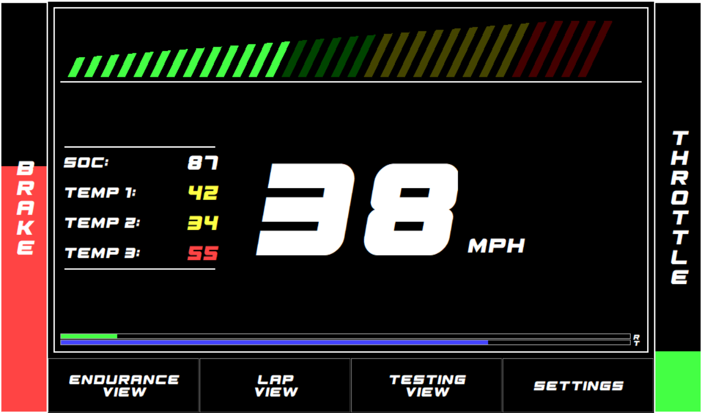

# Dashboard 2023
## GUI Hierarchy
### Low Voltage View
The Low Voltage View is the primary view for when the car is not in drive mode. The lv-view is designed for calibration, configuration,
and debugging. When the car is first powered on it will enter the lv-view, where it will instruct the driver on how to enter drive-mode.
The lv-view is structured in 3 main sections, correlating to the appropriate drive-states.
- Initialization State
The initialization state occurs when the car first enters low voltage. This state only lasts until the ECU has properly initialized and has begun
sending CAN messages. After the first ECU CAN message has been received, the lv-view will enter the low-voltage state
- Low Voltage State
The low voltages state is present as long as the car is in low voltage. This view will allow for pedal calibration, adjustment of config
values, adjustment of settings, and viewing of debug information. The low voltage view will also inform the driver on how to turn on
high voltage.
- High Voltage State
The high voltage state occurs when the car has just entered high voltage, but is still not ready to drive. The high voltage state will not allow
calibration or configuration, but basic settings and debugging will still be available. The high voltage state will inform the driver on how to
start the car. Upon the starting of the car, the GUI will exit the low voltage view and transfer to a drive view.

### Speed View
The Speed View is the simplest drive view, intended for general driving. The layout of this view is shown below.

- The bars on the left and right show the position of the brake and throttle pedals, respectively.
- The bar on the top of the screen shows the current RPM as a portion of the maximum RPM, being 5500.
- The two bars on the bottom of the screen show the torque and regen percentage.
  - The torque percentage controls the maximum amount of torque able to be sent to the inverter, as a portion of 230Nm.
  - The regen percentage controls the maximum amount of torque able to be sent during regenerative braking, as a portion of 23Nm.
- The text in the center of the screen showns the speed of the car in MPH.
- The four buttons on the bottom of the screen allow the driver to switch to different drive views, labeled respectively.

### Endurance View
The Endurance View is designed for use at endurance events. The endurance view is structured similarly to the Speed View, with the main difference
being the usage of the center text as the vehicle state of charge, rather than a speed. The Stat Panel on the left of the screen is also extented,
with the state of charge being removed and additional temperatures being added.